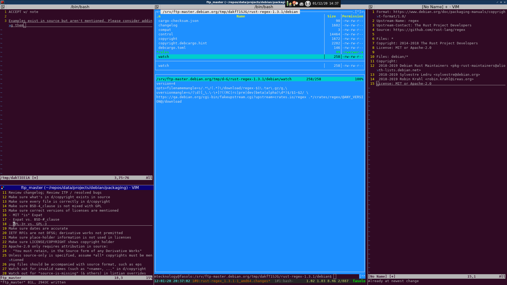

FTP Master Notes
================

Server: fasolo.debian.org
IRC: #debian-ftp-private

dak bot commands
----------------

!lock (NEW|rm|override|ALL)

- ALL - used by masters during release (or big code change)
- NEW - multiple people can hold

process-new command itself locks packages

!locked - shows current lock holders

FTP Master Server
-----------------

dak queue-report - show current queue

- [N] means package has a note; left by trainees

Environment setup:

- git clone /home/paultag/git/rnp.git
- Read man pages in rnp/doc/
- cat ~joerg/.tmux.conf >~/.tmux.conf

Using mc is strongly recommended (some hack exists for it)

Use a separate session for process-new
- c: check
- n: editor for notes
- s: skip

Response::

    ACCEPT|REJECT|PROD
    <reason>

With a note saved, use skip to move on to the next package

Do not mess with backports{,-new}, testing, security suites

Midnightcommander
-----------------

Such an annoying file browser...

Sane configuration::

    F9 > Options:

      > Configuration Options:
        - De-select 'Verbose operation'
        - De-select 'Compute totals'
        - De-select 'Use internal view'
	- De-select 'Auto save setup'

      > Layout:
	- Horizontal
        - De-select 'Equal split' (14/X)
        - De-select 'Menubar visible'
        - De-select 'Keybar visible'
        - De-select 'Hintbar visible'
        - De-select 'Show free space'

      > Panel:
        - De-select 'Auto save panels setup'

      > Confirmation:
        - Select 'Execute'
        - Select 'Exit'

Hotkeys:

- Ctrl+O -- toggle between cli/browser
- Alt+t -- Change panel display
- Alt+i -- Set other terminal to same directory
- F9 -- Access menu

Working on FTP Master Server
----------------------------

Very strict expectations for interaction on this server, down to keystrokes.

1. ssh fasolo.debian.net

   + dak process-new

2. command ssh fasolo.debian.net

   + tpn

``less debian/copyright``; copy to other window

- Review changelog; Review ITP / resolved bugs
- Make sure what's in d/copyright exists in source
- Make sure every file is correctly in d/copyright
- Make sure BSD-4_clause is not mixed with GPL
- Make sure correct versions of licenses are mentioned

  + MIT "is" Expat
  + Expat vs. BSD-#_clause
  + GPL-3+ vs. GPL-3

- Make sure dates are accurate
- IETF RFCs are not DFSG; derivative works not premitted
- Make sure place-holder information is not used in licenses
- Make sure LICENSE/COPYRIGHT shows copyright holder
- Should Maintainer: be be a team address?
- Apache-2.0 only requires attribution in source:

  + "You must retain, in the Source form of any Derivative Works"

- Unless source-only is specified, assume *all* copyrights must be mentioned
- png files should be accompanied with source format, such as eps
- Watch out for invalid names (such as "<name>, ..." in d/copyright
- Watch out for "source-is-missing" (& others) in lintian overrides
- Verify package does not override/contain major lintian problems
- For team-maintained packages, make sure Maintainer: field is the team addr
- Check that relevant docs are in d/docs
- Check that relevant man pages are in d/manpages

``grep -ir copyright``

Common Comments
---------------

1. The Lintian overrides for the source-is-missing tags are not
   sufficient.  You need to repack the orig.tar to remove the minified
   files, or include the source in debian/missing-sources/ and ensure the
   minified sources can be produced from these using tools in the archive.

   Further see "Source package missing source" in the REJECT-FAQ.

2. Is gradle/wrapper/gradle-wrapper.jar produced from source code in this
   package?  If not, it needs to be filtered out.

3. Can the various generated files in foo/ be regenerated?

4. ACCEPT and make a note to file a bug once the BTS learns of the package

   - The names of other organisations need to be substituted into the
     third clause of the license (see the two COPYING files).

5. Simply pointing at a file that might be on a system is insufficient,
   please update the license text in d/copyright to something such as:

   .. code-block:: text

     License: GPL-3+
      This package is free software; you can redistribute it and/or modify
      it under the terms of the GNU General Public License as published by
      the Free Software Foundation, either version 3 of the License, or
      (at your option) any later version.
      .
      This package is distributed in the hope that it will be useful,
      but WITHOUT ANY WARRANTY; without even the implied warranty of
      MERCHANTABILITY or FITNESS FOR A PARTICULAR PURPOSE.  See the
      GNU General Public License for more details.
      .
      You should have received a copy of the GNU General Public License
      along with this program.  If not, see <http://www.gnu.org/licenses/>.
      .
      On Debian systems, the complete text of the GNU General
      Public License version 3 can be found in "/usr/share/common-licenses/GPL-3".
